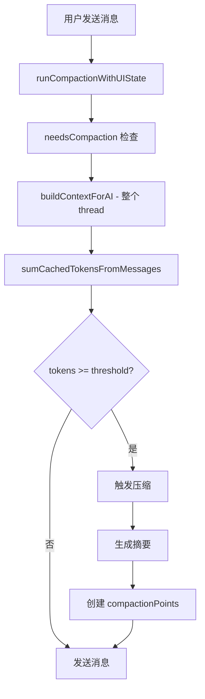

## 前言

在使用 Chatbox 的过程中，我发现了一个让我困惑的问题：**即使我将上下文消息数量设置为 6，系统仍然会触发压缩**。这引发了我对压缩机制的深入探究。

## 问题发现

### 用户场景

```yaml
设置: maxContextMessageCount = 6
Thread 状态: 1000 条消息
期望: 只发送最近 6 条消息给 AI
实际: 系统触发了自动压缩
```

**困惑点**：明明只发送 6 条消息，为什么要压缩整个 thread？

## 当前实现分析

### 核心逻辑

Chatbox 使用两个独立的机制来管理消息：

```typescript
// 1. 上下文控制（运行时）
maxContextMessageCount: number  // 控制发送给 AI 的消息数量

// 2. 自动压缩（存储层）
autoCompaction: boolean          // 控制 thread 的存储优化
```

### 压缩触发流程



### 关键代码分析

```typescript
// compaction.ts: needsCompaction()
async function needsCompaction(sessionId: string): Promise<boolean> {
  const session = await chatStore.getSession(sessionId)

  // 问题：这里使用的是整个 thread 的所有消息！
  const currentContext = buildContextForAI({
    messages: session.messages,        // ← 所有消息，不是上下文内的消息
    compactionPoints: session.compactionPoints,
  })

  const currentTokens = sumCachedTokensFromMessages(currentContext)
  // 即使 maxContextMessageCount = 6，这里计算的是所有消息的 tokens

  return checkOverflow(currentTokens)
}
```

### 问题所在

| 层级 | 机制 | 范围 | 问题 |
|------|------|------|------|
| 运行时 | maxContextMessageCount | 上下文内（6 条） | ✅ 符合预期 |
| 存储层 | autoCompaction | 整个 thread（1000 条） | ❌ 超出用户预期 |

**核心矛盾**：
- 用户设置：`maxContextMessageCount = 6`
- 压缩检查：基于整个 thread 的 1000 条消息
- 结果：6 条消息没超阈值，但 1000 条超了 → 触发压缩

## 设计困境

### 方案 A：基于整个 thread 压缩（当前实现）

**优点**：
- ✅ 保留完整的历史记录
- ✅ 用户随时可以增加 `maxContextMessageCount` 看到更多历史
- ✅ 压缩后的 summary 可以被搜索、导出、重新生成
- ✅ 避免存储爆炸

**缺点**：
- ❌ 压缩了用户"当前看不到"的消息
- ❌ 逻辑不清晰，用户困惑
- ❌ 可能触发不必要的压缩

### 方案 B：只压缩上下文内的消息

**优点**：
- ✅ 只压缩"真正会发送"的消息
- ✅ 逻辑清晰，符合用户预期
- ✅ 避免不必要的压缩

**缺点**：
- ❌ **信息丢失**：上下文外的消息永远不会被压缩
- ❌ **存储爆炸**：thread 有 10000 条，其中 9994 条永远保留原始文本
- ❌ **无法恢复**：用户想增加上下文时，旧消息已经丢失
- ❌ **内存泄漏**：大量未压缩的历史消息占用存储空间

### 实际场景对比

```
场景：100 条消息，maxContextMessageCount = 10

方案 A（当前）：
├─ 消息 1-100：全部参与压缩检查
├─ 触发压缩：保留 summary + 最近 50 条
└─ 结果：用户可以随时增加上下文看到历史 ✓

方案 B（只压缩上下文）：
├─ 消息 1-90：永远不会被压缩 ❌
├─ 消息 91-100：会被压缩 ✓
└─ 结果：存储爆炸，历史永久丢失 ❌
```

## 创新方案：渐进式压缩

### 核心思想

> **从最新消息开始压缩，递归向后检查，自然形成分层数据**

### 算法流程

```typescript
async function progressiveCompaction(
  sessionId: string,
  newMessageIndex: number,
  contextLimit: number
): Promise<void> {
  const session = await chatStore.getSession(sessionId)
  const messages = session.messages

  // 步骤 1: 计算上下文范围
  const contextStart = Math.max(0, newMessageIndex - contextLimit)
  const contextMessages = messages.slice(contextStart, newMessageIndex + 1)

  // 步骤 2: 检查上下文是否需要压缩
  const contextTokens = sumCachedTokensFromMessages(contextMessages)
  const threshold = getCompactionThreshold(session)

  if (contextTokens > threshold) {
    // 步骤 3: 压缩上下文内的消息
    const summary = await generateSummary(contextMessages)
    const compactionPoint = createCompactionPoint(
      contextMessages[0].id,
      summary.id
    )
    session.compactionPoints.push(compactionPoint)

    // 步骤 4: 递归检查上下文外的消息 + summary
    const outsideMessages = messages.slice(0, contextStart)
    const allForCheck = [...outsideMessages, summary]

    if (allForCheck.length > 0) {
      const allTokens = sumCachedTokensFromMessages(allForCheck)

      if (allTokens > threshold) {
        // 继续递归压缩
        await progressiveCompaction(
          sessionId,
          contextStart - 1,
          contextLimit
        )
      }
    }
  }
}
```

### 执行示例

```
初始状态：20 条消息，上下文限制 10

发送第 21 条消息：

第一轮检查：
├─ 范围：消息 11-21（上下文内的 10 条 + 新消息）
├─ 计算：sum(11-21) = 15000 tokens
├─ 判断：15000 > threshold(12000) → 需要压缩
└─ 操作：压缩 11-21 → summary1

第二轮检查（递归）：
├─ 范围：消息 1-10 + summary1
├─ 计算：sum(1-10) + summary1 = 8000 + 2000 = 10000 tokens
├─ 判断：10000 < threshold(12000) → 不需要压缩
└─ 操作：停止

最终状态：
├─ 消息 1-10：保持原样
├─ summary1：包含消息 11-21 的摘要
└─ 总计：10 条原始消息 + 1 个摘要
```

### 优点

1. **✅ 只压缩活跃消息**
   - 优先处理用户会看到的内容
   - 避免了"压缩看不到的消息"的问题

2. **✅ 渐进式优化**
   - 从新到旧逐层压缩
   - 形成自然的摘要金字塔

3. **✅ 存储效率**
   - 压缩的是"活跃"的消息
   - 不会无限累积

4. **✅ 用户友好**
   - 上下文始终可用
   - 压缩逻辑清晰

### 潜在问题与解决

#### 问题 1：上下文外的消息怎么办？

**场景**：100 条消息，上下文限制 10

```
按渐进式方案：
- 检查 91-100（上下文内）
- 如果超过阈值 → 压缩 91-100 → summary1
- 递归检查 1-90 + summary1
```

**解决方案**：混合策略

```typescript
async function hybridCompaction(
  sessionId: string,
  contextLimit: number
): Promise<void> {
  const session = await chatStore.getSession(sessionId)
  const messages = session.messages
  const totalMessages = messages.length

  // 1. 优先压缩上下文内的消息（渐进式）
  const contextStart = Math.max(0, totalMessages - contextLimit)
  const contextMessages = messages.slice(contextStart)

  if (shouldCompact(contextMessages)) {
    await compactRange(contextStart, totalMessages - 1)
  }

  // 2. 如果上下文外消息太多，批量压缩（避免存储爆炸）
  const outsideMessages = messages.slice(0, contextStart)
  const OUTSIDE_THRESHOLD = 100 // 超过 100 条就压缩

  if (outsideMessages.length > OUTSIDE_THRESHOLD) {
    // 分批压缩，每批 50 条
    for (let i = 0; i < outsideMessages.length; i += 50) {
      await compactRange(i, Math.min(i + 49, contextStart - 1))
    }
  }
}
```

#### 问题 2：递归深度控制

**极端情况**：
- 上下文 10 条
- 每条都很短（10 tokens）
- 10 条 = 100 tokens，远低于阈值
- 但 thread 有 10000 条消息

**解决方案**：

```typescript
// 限制递归深度
const MAX_COMPRESSION_ROUNDS = 3

// 或限制时间范围
const MAX_COMPRESSION_AGE = '7d' // 只压缩最近 7 天的消息

// 或限制消息数量
const MAX_COMPRESSION_MESSAGES = 500
```

#### 问题 3：原始消息保留

**需求**：用户想查看被压缩的原始消息

**解决方案**：

```typescript
// 保留原始消息的引用
interface CompactionPoint {
  startMessageId: string
  summaryId: string
  originalMessages?: Message[]  // 可选：保留原始消息
  compressedAt: Date
}

// UI 支持"展开详情"
<button onClick={() => expandSummary(compactionPoint)}>
  展开原始消息
</button>
```

### 分层策略总结

| 消息位置 | 压缩策略 | 原因 |
|---------|---------|------|
| 上下文内（最近 10 条） | 实时检查，立即压缩 | 用户会看到，需要优化 |
| 上下文外（较新） | 渐进式压缩 | 用户可能增加上下文查看 |
| 上下文外（较旧） | 批量压缩 | 用户看不到，但需要控制存储 |
| 极旧消息（> 30 天） | 归档或删除 | 长期存储优化 |

## 用户教育改进

### UI 提示优化

```typescript
// 在 TokenCountMenu 中显示
<div className="context-info">
  <h3>上下文设置</h3>
  <div className="current-context">
    当前上下文：6 条消息 (~2k tokens)
  </div>
  <div className="thread-total">
    Thread 总计：1000 条消息 (~200k tokens)
  </div>
  <div className="compaction-status">
    已压缩：850 条消息 → 3 个摘要
  </div>
</div>
```

### 独立控制选项

```typescript
// 设置界面
{
  // 运行时控制
  maxContextMessageCount: 6,        // 发送给 AI 的消息数

  // 存储层控制
  autoCompactionEnabled: true,      // 是否自动压缩整个 thread
  compactionThreshold: 0.6,         // 触发压缩的阈值（60%）

  // 高级选项
  compactionStrategy: 'progressive', // 'progressive' | 'aggressive' | 'conservative'
  keepOriginalMessages: false,      // 是否保留原始消息
}
```

### 智能压缩策略

```typescript
// 根据用户行为动态调整
async function adaptiveCompaction(user: User) {
  const behavior = analyzeUserBehavior(user)

  if (behavior.frequentlyIncreasesContext) {
    // 用户经常增加上下文 → 保留更多未压缩消息
    return {
      threshold: 0.8,  // 提高阈值
      keepOriginal: true
    }
  } else if (behavior.neverIncreasesContext) {
    // 用户从不增加上下文 → 更激进地压缩
    return {
      threshold: 0.4,  // 降低阈值
      keepOriginal: false
    }
  }
}
```

## 架构设计建议

### 分层清晰

```
┌─────────────────────────────────────┐
│         用户界面层                   │
│  - 显示上下文消息数                  │
│  - 显示 thread 总计                  │
│  - 显示压缩状态                      │
└─────────────────────────────────────┘
              ↓
┌─────────────────────────────────────┐
│         运行时层                     │
│  - maxContextMessageCount 控制       │
│  - 构建发送给 AI 的上下文             │
└─────────────────────────────────────┘
              ↓
┌─────────────────────────────────────┐
│         存储层                       │
│  - autoCompaction 控制               │
│  - 渐进式压缩策略                    │
│  - 批量压缩旧消息                    │
└─────────────────────────────────────┘
```

### 数据结构

```typescript
interface Session {
  // 运行时
  settings: {
    maxContextMessageCount: number
    countTotalTokens: boolean
    contextMessageSortOrder: 'asc' | 'desc'
  }

  // 存储层
  compactionPoints: CompactionPoint[]
  messages: Message[]

  // 压缩配置
  compactionConfig: {
    enabled: boolean
    threshold: number
    strategy: 'progressive' | 'hybrid'
    keepOriginal: boolean
  }
}
```

## 总结

### 当前设计

- ✅ 功能完整，保留历史
- ❌ 用户困惑，逻辑不清晰
- ⚠️ 压缩和上下文控制耦合度低

### 渐进式方案

- ✅ 只压缩活跃消息
- ✅ 递归优化，自然分层
- ✅ 结合批量处理避免存储爆炸
- ⚠️ 实现复杂度较高

### 核心理念

> **maxContextMessageCount 控制"我现在看什么"**
> **autoCompaction 控制"我怎么存储历史"**

两者应该独立工作，但需要清晰的边界和用户教育。

### 实施建议

1. **短期**：优化 UI 提示，让用户理解两层逻辑
2. **中期**：实现渐进式压缩，提升用户体验
3. **长期**：根据用户行为自适应调整策略

## 参考资料

- [Chatbox 源码](https://github.com/Bin-Huang/chatbox)
- [上下文管理文档](./context-management.md)
- [压缩算法设计](./compaction-algorithm.md)
