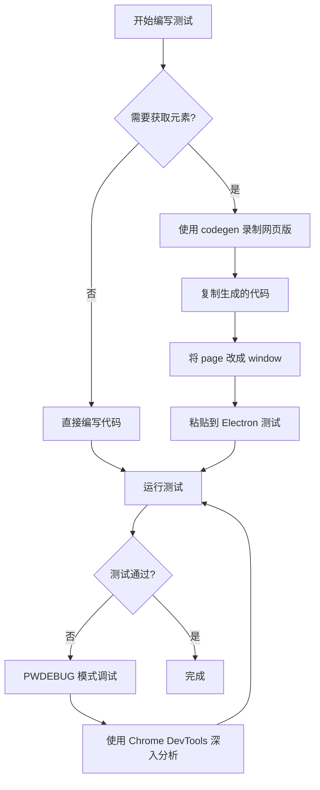

## 前言

在使用 Playwright 进行 Electron 应用自动化测试时，我们经常会遇到需要获取元素选择器、调试测试代码的场景。本文总结了多种调试方法，帮助你高效开发 Electron 自动化测试。

## 问题背景

### 核心需求

在开发 Electron 自动化测试时，我们需要：

1. **获取元素选择器** - 快速定位页面元素
2. **自动生成代码** - 减少手动编写代码的工作量
3. **实时调试** - 查看测试执行过程和结果

### 遇到的挑战

```bash
# 尝试直接对 Electron 使用 codegen
npx playwright codegen /Applications/Chatbox.app/Contents/MacOS/Chatbox

# 错误：不支持 Electron 可执行文件
Error: Download is starting
```

**问题**：Playwright 的 `codegen` 工具不支持直接录制 Electron 应用。

## 解决方案对比

### 方案 1: 使用 PWDEBUG 调试模式

#### 启动方式

```bash
# 启用 Playwright Inspector 调试模式
PWDEBUG=1 npx playwright test tests/record.spec.ts --project=electron
```

#### 创建测试文件

```typescript
// tests/record.spec.ts
import { test, _electron as electron } from '@playwright/test';

test('录制模式 - 手动操作应用', async () => {
  // 启动 Electron 应用
  const electronApp = await electron.launch({
    executablePath: '/Applications/Chatbox.app/Contents/MacOS/Chatbox'
  });

  // 获取主窗口
  const window = await electronApp.firstWindow();

  console.log('✅ Chatbox 应用已启动！');
  console.log('📝 现在可以在 Inspector 中操作应用');

  // 保持 Inspector 活跃状态
  await window.pause();

  await electronApp.close();
});
```

#### Playwright Inspector 功能

| 功能 | 说明 |
|------|------|
| 🎯 Pick locator | 点击后悬停元素可查看选择器 |
| ▶️ Resume | 继续执行测试 |
| ⏸️ Pause | 暂停测试 |
| ⏭️ Step over | 单步执行 |
| 📋 Copy | 复制生成的代码 |

#### 优点

✅ 支持 Electron 应用  
✅ 实时查看元素  
✅ 调试现有测试  
✅ 查看执行结果

#### 缺点

❌ Pick locator 在 Electron 上不稳定  
❌ 不能自动录制操作  
❌ 需要手动复制代码

---

### 方案 2: 使用网页版 codegen（推荐）

#### 原理

网页版 Chatbox 和 Electron 版的 DOM 结构基本一致，可以先在网页版录制，然后移植代码到 Electron。

#### 启动方式

```bash
# 录制网页版 Chatbox
npx playwright codegen https://web.chatboxai.app
```

#### 界面说明

```
┌─────────────────────────────────────────────────────┐
│  左侧：Chatbox 网页    │    右侧：代码生成器         │
│                       │                             │
│  [可操作的浏览器]      │    🎯 Pick locator         │
│                       │    ⏺️ Record              │
│                       │    📋 Copy                 │
│                       │                             │
│                       │  生成的代码：               │
│                       │  await page.locator()      │
└─────────────────────────────────────────────────────┘
```

#### 使用流程

1. **启动 codegen**
   ```bash
   npx playwright codegen https://web.chatboxai.app
   ```

2. **录制操作**
   - 确保 Record 按钮激活（红色）
   - 在网页中操作：点击、输入等
   - 右侧实时生成代码

3. **获取元素选择器**
   - 点击 Pick locator（🎯 图标）
   - 鼠标悬停在元素上
   - 显示选择器代码

4. **移植到 Electron**
   ```typescript
   // 网页版生成的代码
   await page.locator('#message-input').fill('你好');
   await page.getByRole('button', { name: /send/i }).click();

   // 修改为 Electron 版（只需把 page 改成 window）
   await window.locator('#message-input').fill('你好');
   await window.getByRole('button', { name: /send/i }).click();
   ```

#### 优点

✅ 完美的元素拾取功能  
✅ 自动生成代码  
✅ 实时预览  
✅ 操作简单直观

#### 缺点

⚠️ 需要确认 DOM 结构是否一致  
⚠️ 需要手动移植代码

---

### 方案 3: 使用 Chrome DevTools

#### 启动方式

**步骤 1**: 启动 Electron 应用并开启调试

```bash
# 方式 A: 使用测试脚本
PWDEBUG=1 npx playwright test tests/record.spec.ts --project=electron

# 方式 B: 直接启动应用
/Applications/Chatbox.app/Contents/MacOS/Chatbox --inspect-port=9222
```

**步骤 2**: 连接 Chrome DevTools

1. 打开 Chrome 浏览器
2. 访问 `chrome://inspect`
3. 点击 "Configure"
4. 添加 `localhost:9222`
5. 找到 Chatbox 并点击 "inspect"

#### 使用元素选择器

```
Chrome DevTools 界面：
┌──────────────────────────────────────────┐
│  📍 (左上角箭头图标)                      │
│     点击后选择页面元素                    │
│                                          │
│  Elements Panel:                         │
│  <button id="send-btn">                  │
│    <svg class="icon">...</svg>           │
│  </button>                               │
│                                          │
│  选择器: #send-btn                       │
└──────────────────────────────────────────┘
```

#### 优点

✅ 原生调试工具  
✅ 功能最强大  
✅ 可查看所有元素属性  
✅ 最稳定可靠

#### 缺点

❌ 需要手动复制选择器  
❌ 不能自动生成代码  

---

## 方案选择建议

### 场景对照表

| 场景 | 推荐方案 | 原因 |
|------|---------|------|
| 快速获取元素选择器 | 网页版 codegen | 自动生成，效率高 |
| 调试现有测试 | PWDEBUG 模式 | 支持断点调试 |
| 深入分析 DOM | Chrome DevTools | 功能最全 |
| 学习测试代码 | 网页版 codegen | 可视化学习 |
| 复杂问题排查 | Chrome DevTools | 原生工具最可靠 |

### 推荐工作流



---

## 常见问题

### Q1: 为什么不能直接用 codegen 录制 Electron？

**A**: Playwright 的 codegen 工具设计用于录制 Web 浏览器，不支持 Electron 可执行文件。Electron 虽然使用 Chromium，但有自己的进程模型。

### Q2: 网页版和 Electron 版的 DOM 结构一样吗？

**A**: 99% 的情况下是一样的。Chatbox 的网页版和 Electron 版使用相同的渲染代码，只是打包方式不同。

### Q3: PWDEBUG 的 Pick locator 为什么不稳定？

**A**: Electron 的窗口管理和事件处理与普通浏览器不同，导致 Pick locator 功能在 Electron 上有时无法正常工作。

### Q4: 如何确认移植的代码是否正确？

**A**: 使用 PWDEBUG 模式运行测试，在 Inspector 中查看元素是否正确定位。

---

## 实战示例

### 示例 1: 发送消息

**使用 codegen 录制**：

```bash
npx playwright codegen https://web.chatboxai.app
```

**操作步骤**：
1. 点击"新对话"按钮
2. 在输入框输入"你好"
3. 点击发送按钮

**生成的代码（网页版）**：

```typescript
await page.getByRole('button', { name: '新对话' }).click();
await page.locator('#message-input').fill('你好');
await page.getByRole('button', { name: /send/i }).click();
```

**移植到 Electron**：

```typescript
test('发送消息', async () => {
  const electronApp = await electron.launch({
    executablePath: '/Applications/Chatbox.app/Contents/MacOS/Chatbox'
  });

  const window = await electronApp.firstWindow();

  // 只需把 page 改成 window
  await window.getByRole('button', { name: '新对话' }).click();
  await window.locator('#message-input').fill('你好');
  await window.getByRole('button', { name: /send/i }).click();

  await electronApp.close();
});
```

### 示例 2: 切换模型

**使用 codegen 录制**：

1. 点击模型选择器
2. 选择第一个模型

**生成的代码**：

```typescript
// 网页版
await page.locator('.model-selector').click();
await page.locator('.model-item').first().click();
```

**移植到 Electron**：

```typescript
// Electron 版
await window.locator('.model-selector').click();
await window.locator('.model-item').first().click();
```

---

## 高级技巧

### 技巧 1: 使用测试装置（Fixtures）

创建可复用的测试装置：

```typescript
// tests/fixtures/chatbox.ts
import { test as base, _electron as electron } from '@playwright/test';

type ChatboxFixtures = {
  electronApp: any;
  window: any;
};

export const test = base.extend<ChatboxFixtures>({
  electronApp: async ({}, use) => {
    const app = await electron.launch({
      executablePath: '/Applications/Chatbox.app/Contents/MacOS/Chatbox'
    });
    await use(app);
    await app.close();
  },
  
  window: async ({ electronApp }, use) => {
    const win = await electronApp.firstWindow();
    await use(win);
  }
});

export { expect } from '@playwright/test';
```

**使用装置**：

```typescript
import { test, expect } from './fixtures/chatbox';

test('发送消息', async ({ window }) => {
  await window.locator('#message-input').fill('你好');
  await window.getByRole('button', { name: /send/i }).click();
});
```

### 技巧 2: 等待元素加载

```typescript
// 等待特定元素出现
await window.waitForSelector('#message-input', { state: 'visible' });

// 等待网络请求完成
await window.waitForLoadState('networkidle');

// 等待元素可点击
await expect(window.locator('#send-btn')).toBeEnabled();
```

### 技巧 3: 调试选择器

```typescript
// 在 PWDEBUG 模式下测试选择器
await window.pause(); // 暂停，打开 Inspector

// 在 Inspector Console 中测试
// await window.locator('#message-input').isVisible()
```

---

## 配置优化

### 排除不需要的测试

修改 `playwright.config.ts`，让不同项目只运行相关测试：

```typescript
import { defineConfig, devices } from '@playwright/test';

export default defineConfig({
  testDir: './tests',
  testMatch: '**/{tests,framework}/**/*.spec.{js,ts}',
  
  projects: [
    {
      name: 'electron',
      use: {
        // Electron 配置
      },
      // 排除 mobile 测试
      testIgnore: '**/mobile/**/*.spec.ts',
    },
    {
      name: 'chromium',
      use: devices['Desktop Chrome'],
      testIgnore: '**/mobile/**/*.spec.ts',
    },
    {
      name: 'mobile-android',
      use: {
        // Android 配置
      },
      // 只运行 mobile 测试
      testMatch: '**/mobile/**/*.spec.ts',
    },
  ],
});
```

---

## 总结

### 关键要点

1. **网页版 codegen 是最佳选择**
   - 自动生成代码
   - 元素拾取功能完善
   - 99% 代码可直接移植

2. **PWDEBUG 用于调试**
   - 不是录制工具
   - 用于断点调试和查看结果

3. **Chrome DevTools 用于深入分析**
   - 最强大的调试工具
   - 适合复杂问题排查

### 快速参考

```bash
# 录制操作（推荐）
npx playwright codegen https://web.chatboxai.app

# 调试测试
PWDEBUG=1 npx playwright test tests/your-test.spec.ts --project=electron

# 运行特定测试
npx playwright test tests/your-test.spec.ts --project=electron

# UI 模式运行
npx playwright test tests/your-test.spec.ts --project=electron --ui
```

### 代码移植模板

```typescript
// 网页版 → Electron 版

// 1. 导入
- import { test } from '@playwright/test';
+ import { test, _electron as electron } from '@playwright/test';

// 2. 启动应用
+ const electronApp = await electron.launch({
+   executablePath: '/Applications/Chatbox.app/Contents/MacOS/Chatbox'
+ });
+ const window = await electronApp.firstWindow();

// 3. 所有 page 改成 window
- await page.locator('#input').fill('text');
+ await window.locator('#input').fill('text');

// 4. 关闭应用
+ await electronApp.close();
```

---

## 参考资料

- [Playwright 官方文档](https://playwright.dev)
- [Playwright Electron 支持](https://playwright.dev/docs/api/class-electron)
- [Chrome DevTools 协议](https://chromedevtools.github.io/devtools-protocol/)
- [Chatbox 项目仓库](https://github.com/Bin-Huang/chatbox)
